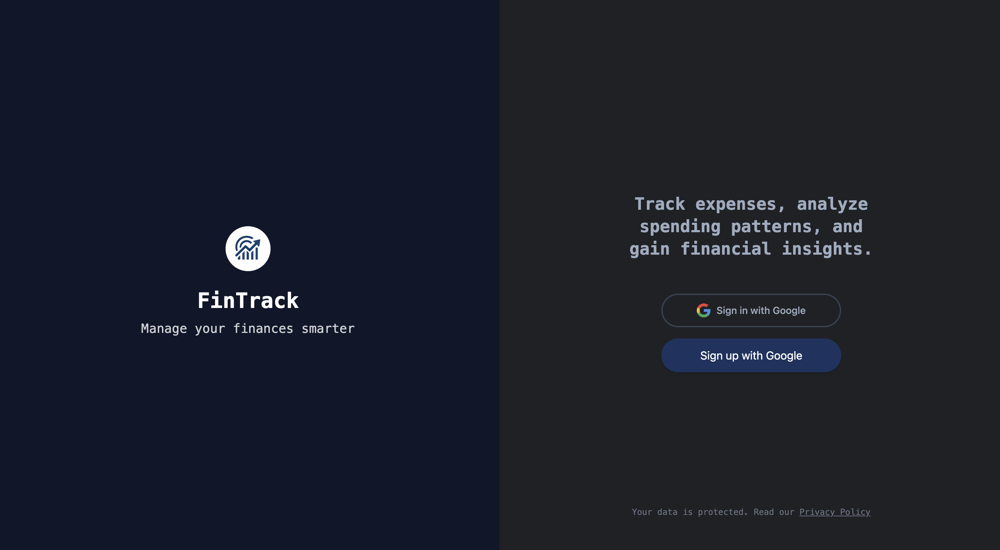
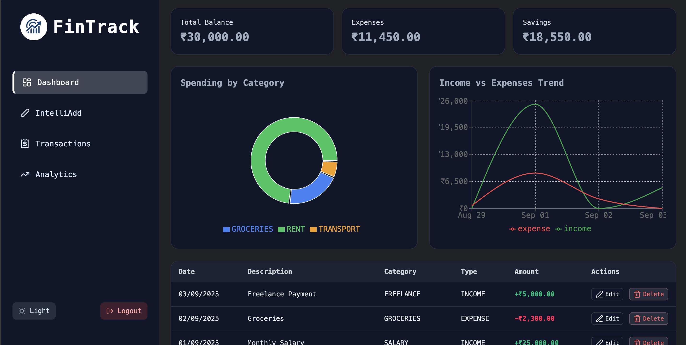
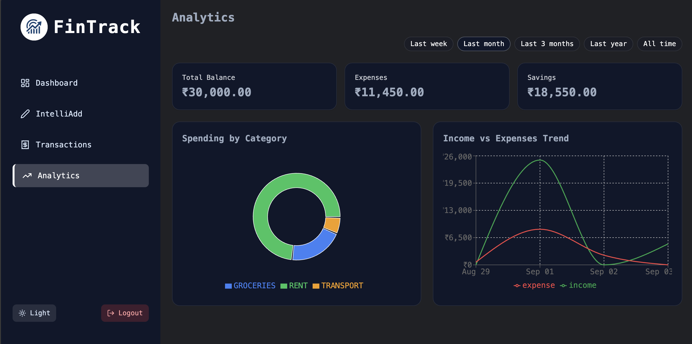
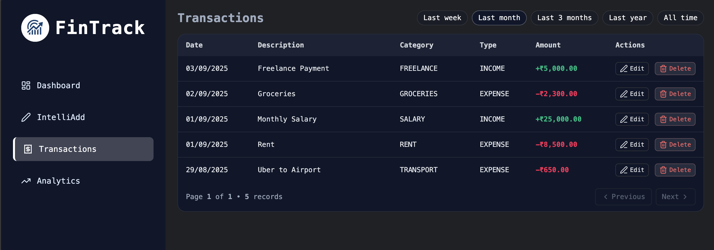
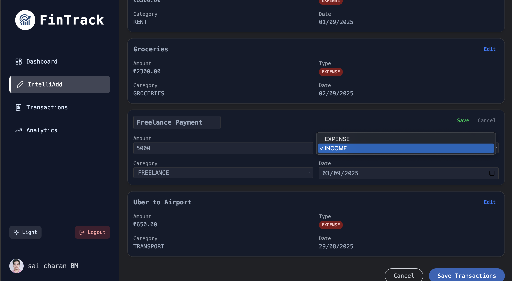
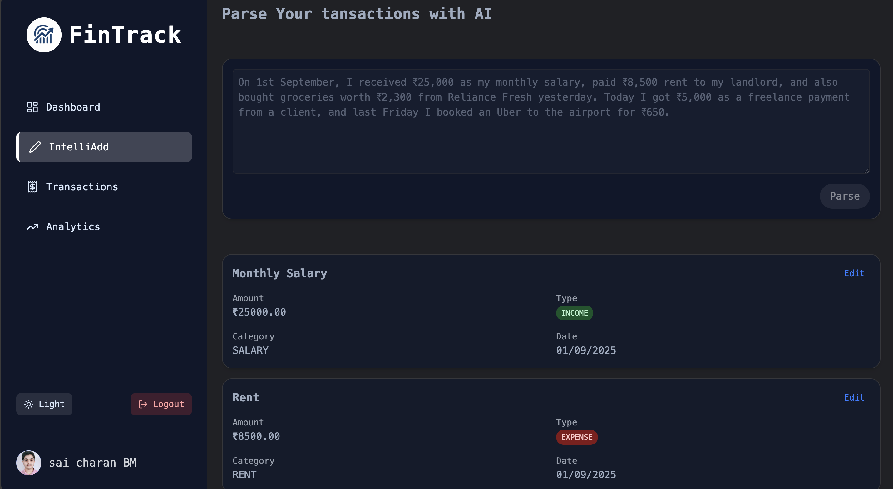
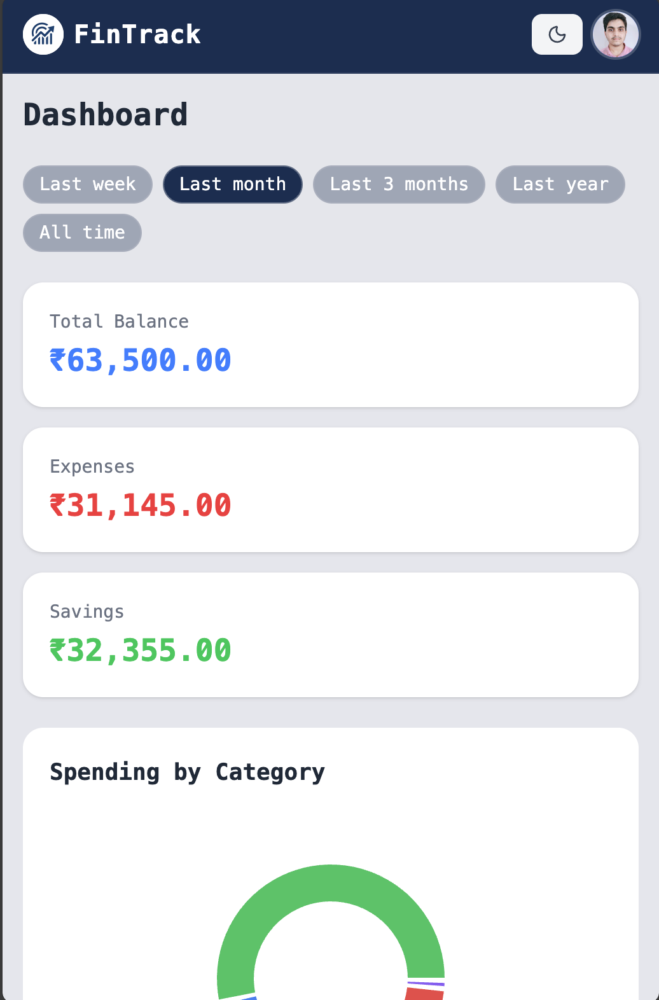
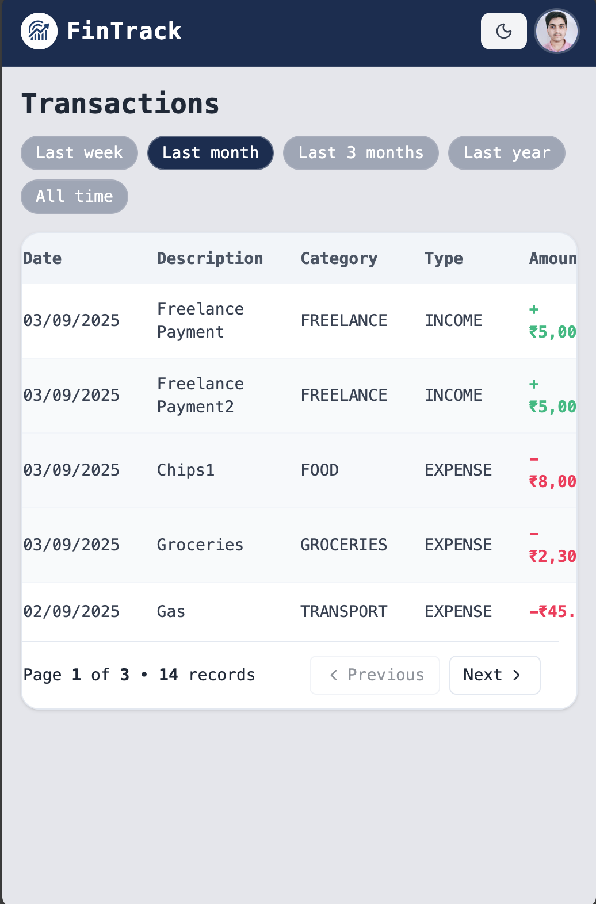

# FinTrack — Screenshots

A quick visual tour of FinTrack across desktop and mobile.

---

## Desktop

<table>
  <tr>
    <td align="center">
      
       Home (Desktop)
    </td>
    <td align="center">
      
       Dashboard (Desktop)
    </td>
  </tr>
  <tr>
    <td align="center">
      
       Analytics (Desktop)
    </td>
    <td align="center">
      
       Transactions (Desktop)
    </td>
  </tr>
  <tr>
    <td align="center">
      
       Add Transaction (Desktop)
    </td>
    <td align="center">
      
       AI Parser (Desktop)
    </td>
  </tr>
</table>

---

## Mobile

<table>
  <tr>
    <td align="center">
      
       Home (Mobile)
    </td>
    <td align="center">
      
       Dashboard (Mobile)
    </td>
    <td align="center">
      
       Nav Menu (Mobile)
    </td>
  </tr>
  <tr>
    <td align="center">
      
       Transactions (Mobile)
    </td>
    <td></td>
    <td></td>
  </tr>
</table>

---

### Tips

- Clicking any image opens the full-resolution screenshot.
